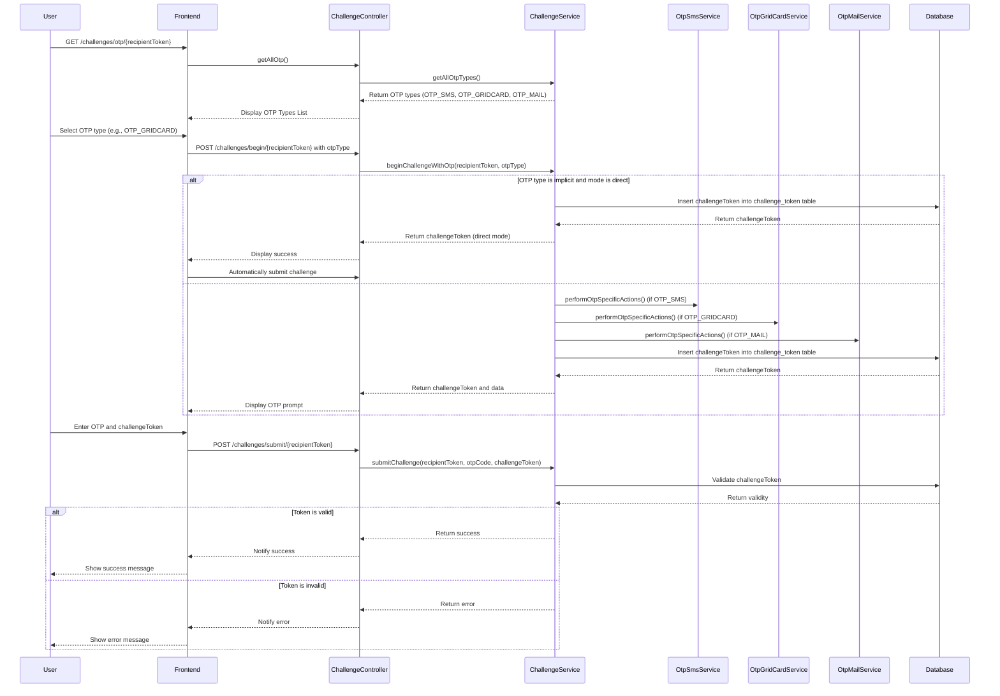

# **Challenge API Documentation**

This document outlines the RESTful API for managing authentication challenges, including initiating, submitting, and
retrieving OTPs. It details various scenarios, workflows, and implementation details to guide developers in integrating
these APIs.

---

## **Scenario: Accepting a Letter with OTP**

This section explains the workflow for retrieving, initiating, and submitting an OTP challenge to authenticate users
securely. The process adapts based on the selected OTP type and mode of operation.

---

### **Workflow Steps**

---

### **1. Retrieve Available OTP Types (Optional)**

To determine which OTP types are available for a user, the frontend sends a **GET** request to fetch the list of
supported OTP mechanisms. The response includes both primary and secondary OTP types for the recipient.

#### **Endpoint**

```http
GET /challenges/otp/{recipientToken}
```

#### **Response Example**

```json
[
  {
    "otpType": "OTP_GRIDCARD",
    "isPrimary": true
  },
  {
    "otpType": "OTP_SMS",
    "isPrimary": false
  }
]
```

---

### **2. Begin Challenge**

The process of initiating an OTP challenge varies depending on the selected `otpType` and whether the OTP mode is *
*direct** or **manual**.

---

#### **a) Initiating the OTP Challenge**

The frontend sends a **POST** request to the `/challenges/begin/{recipientToken}` endpoint with the selected OTP type.
The backend performs the following actions:

1. **Identify OTP Type and call performOtpSpecificActions method**:
    - OtpMailService for `OTP_MAIL`: Automatically sends an email with the OTP during the initiation process.
    - OtpSmsService for`OTP_SMS`: Sends the OTP to the user via SMS.
    - OtpGridCardService for `OTP_GRIDCARD`: Provides specific grid card details for the user to input.
    - Nothing for OTP direct and implicit
2. **Generate Challenge Token**:
    - A `challengeToken` is created and stored in the database to secure subsequent OTP submissions.
    - The token is valid for a maximum of **180 seconds** (configurable in application.properties).

---

#### **Endpoint**

```http
POST /challenges/begin/{recipientToken}
```

#### **Request Example**

```json
{
  "otpType": "OTP_GRIDCARD"
}
```

#### **Response Example**

```json
{
  "challengeToken": "O8C0alJtniPXL6BaR3AzoYVTlfC0QwhVWML8",
  "otpMode": {
    "otpType": "OTP_GRIDCARD",
    "additionalData": {
      "gridCardId": 8,
      "col": 2,
      "row": 15
    }
  },
  "directMode": false
}
```

---

### **b) Direct Mode Flow**

When the OTP type is implicit, and the mode is **direct**:

- The system bypasses calling any OTP service.

---

### **3. Submit Challenge**

Once the user has received the OTP and `challengeToken` from the **Begin Challenge** response, they submit the OTP for
verification using the `/challenges/submit/{recipientToken}` endpoint.

---

#### **Backend Processing**

1. **Verify Challenge Token**:
    - The backend verifies that the `challengeToken` is valid and not expired.

2. **Identify OTP Type**:
    - Calls the appropriate OTP service to validate the submitted OTP with calling the validateChallenge method:
        - `OTP_MAIL`: Verifies the OTP sent via email.
        - `OTP_SMS`: Verifies the OTP sent via SMS.
        - `OTP_GRIDCARD`: Verifies the grid card entry based on position details.

3. **Validation**:
    - If valid, the challenge is marked as successful.
    - If invalid or expired, an error response is returned.

---

#### **Endpoint**

```http
POST /challenges/submit/{recipientToken}
```

#### **Request Example**

```json
{
  "challengeToken": "abc123def456",
  "otpCode": "123456",
  "otpType": "OTP_GRIDCARD"
}
```

#### **Response Example**

- **Success**:
  ```json
  {
    "status": "success",
    "message": "Challenge validated successfully."
  }
  ```
- **Failure**:
  ```json
  {
    "status": "error",
    "message": "Invalid or expired challenge token."
  }
  ```

---

## **Sequence Diagram**

The diagram below illustrates the end-to-end workflow, highlighting interactions between the user, frontend, backend,
and various OTP services.


